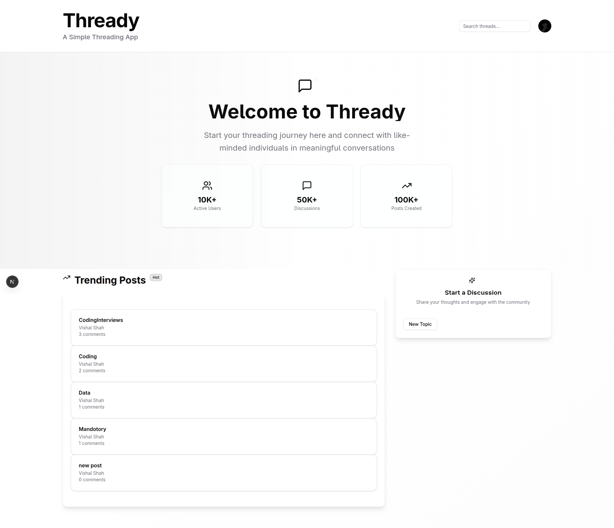

# 🧵 Threadly

**Threadly** is a simple yet powerful thread-based discussion app built with **Next.js**, **Tailwind CSS**, **Prisma**, and **SQLite**. It allows users to create multiple discussion topics, post their opinions, and engage in conversations through deeply nested comments and replies—similar to a forum or threaded social media platform.

---

## ✨ Features

- 🧵 Create and manage multiple discussion topics
- 💬 Add posts under each topic
- 🔁 Comment and reply in multiple nested levels
- 🎨 Responsive and clean UI using Tailwind CSS
- ⚡ Full-stack app powered by Next.js API routes
- 🗃️ Persistent storage with Prisma ORM and SQLite

---

## 🖼️ Preview

Here’s a quick look at Threadly in action:

<p align="center">
  
</p>

> 📌 *Make sure to place your images in `public/screenshots/` folder or use direct image URLs from services like GitHub, Cloudinary, or Imgur.*

---

## 🛠️ Tech Stack

- **Framework**: [Next.js](https://nextjs.org/)
- **Styling**: [Tailwind CSS](https://tailwindcss.com/)
- **Database & ORM**: [Prisma](https://www.prisma.io/) + SQLite
- **Language**: TypeScript / JavaScript

---

## 🚀 Getting Started

### 1. Clone the repository

```bash
git clone https://github.com/your-username/threadly.git
cd threadly
npm install
# or
yarn install
# or
bun install
```

### 2. Setup environment variables
Create a .env file in the root directory:
```env
DATABASE_URL="file:./dev.db"
```

3. Setup the database
Initialize Prisma and apply migrations:
```
npx prisma migrate dev --name init
npx prisma generate
```

4. Start the development server
``` 
npm run dev
# or
yarn dev
# or
bun dev

Visit http://localhost:3000 to view the app.
```

### 📄 License
Licensed under the MIT License.

### 👨‍💻 Author
Made with ❤️ by Vishal Shah
